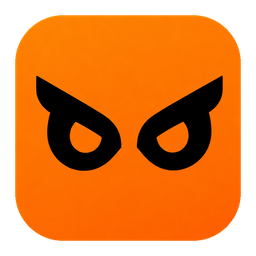

<div align="center">


# Rashnova

### Perekam aktivitas untuk Windows yang menunjukkan setiap perubahan tanpa izin

**Serahkan PC Anda. Terima kembali dengan catatan tersegel tentang apa yang dilakukan padanya.**

[](https://github.com/sathvik-zoldyck/rashnova/releases/latest)
[](https://github.com/sathvik-zoldyck/rashnova/releases)
[](#requirements)
[](#download)
[](LICENSE)

[**Unduh**](https://github.com/sathvik-zoldyck/rashnova/releases/latest) ·
[**Situs web**](https://www.alcyonesecure.com) ·
[**Batasan yang diketahui**](KNOWN_LIMITS.md) ·
[**Privasi**](#privacy) ·
[**Keamanan**](SECURITY.md)

</div>

> **Bahasa** &nbsp;·&nbsp; [English](README.md) · [हिन्दी](README.hi.md) · [ಕನ್ನಡ](README.kn.md) · [മലയാളം](README.ml.md) · [Español](README.es.md) · [Français](README.fr.md) · [Deutsch](README.de.md) · [Português](README.pt.md) · [日本語](README.ja.md) · **Bahasa Indonesia** · [עברית](README.he.md)

---
> [!NOTE]
> Halaman ini diterjemahkan dari bahasa Inggris. Aplikasi Rashnova sendiri berbahasa Inggris, jadi nama tombol dan layar
> di sini tetap dalam bahasa Inggris. Jika halaman ini berbeda dengan [versi bahasa Inggris](README.md), versi bahasa Inggris yang berlaku.


Rashnova merekam apa yang terjadi pada PC Windows saat dipegang orang lain: di tempat servis, di bagian IT, atau oleh
siapa pun yang Anda titipi. Mulai **Repair session** sebelum menyerahkannya. Saat PC kembali, akhiri sesi itu, dan
Rashnova memberi Anda putusan (verdict) dan laporan tentang apa yang dibuka, disalin, diganti namanya, dan dihapus,
program apa yang dijalankan, dan drive USB apa yang dicolokkan.

Setiap entri disegel ke entri sebelumnya, sehingga catatan menunjukkan jika ada yang diubah atau dihapus di dalamnya,
dan menunjukkan setiap rentang waktu ketika tidak ada yang bisa direkam. Semuanya tetap di komputer Anda. Tanpa akun,
tanpa cloud, tanpa telemetri.


> [!NOTE]
> Repositori ini adalah tempat Rashnova **dirilis**: penginstal, catatan rilis, batasan yang diketahui, dan kebijakan
> keamanan. Rashnova adalah perangkat lunak berpemilik (proprietary) dari [Alcyone Secure](https://www.alcyonesecure.com);
> kode sumbernya tidak dipublikasikan di sini.


## Daftar isi

- [Mengapa Rashnova ada](#why)
- [Apa yang dilakukannya](#what-it-does)
- [Yang tidak pernah direkam](#never)
- [Cara kerjanya](#how)
- [Unduh dan pasang](#download)
- [Persyaratan sistem](#requirements)
- [Privasi](#privacy)
- [Batasan yang diketahui](#limits)
- [Pembaruan](#updates)
- [Bantuan dan keamanan](#support)
- [Lisensi](#licence)

<a name="why"></a>
## Mengapa Rashnova ada

Pesawat, kereta, dan kapal membawa kotak hitam. Komputer yang lepas dari tangan Anda tidak membawa apa-apa, dan
orang yang memegangnya punya akses penuh ke semua isinya.

Dan akses itu dipakai. Dalam [studi tahun 2022 oleh peneliti University of Guelph](https://arxiv.org/abs/2211.05824)
(diterbitkan di IEEE Symposium on Security and Privacy 2023), laptop dengan pencatatan aktif dititipkan semalam di 12
tempat servis. Teknisi di enam tempat membuka data pribadi di dalamnya, dan dua menyalin data dari laptop. Antivirus dan
alat endpoint memang tidak dibuat untuk menyadari hal ini: orang itu diberi kuncinya.

Rashnova bukan pencegahan. Rashnova adalah bukti, agar apa yang terjadi bisa diperiksa, bukan diperdebatkan.

> *Percaya itu baik. Bukti lebih baik.*

<a name="what-it-does"></a>
## Apa yang dilakukannya

<table>
<tr>
<td width="50%" valign="top">

**Repair Mode (mode servis).** Sesi yang diawasi, dimulai dengan PIN Anda sebelum diserahkan dan diakhiri dengan PIN
Anda saat PC kembali. Mencatat file yang dibuka, dibuat, diganti namanya, disalin, dan dihapus, program yang dijalankan,
perintah PowerShell yang dijalankan, aktivitas masuk (sign-in), dan penyimpanan USB yang dicolokkan, termasuk setiap file
yang ditulis ke sana. Restart, mematikan, atau sleep tidak pernah mengakhiri sesi: laporan menunjukkan setiap gangguan
dan berapa lama berlangsung.

</td>
<td width="50%" valign="top">


</td>
</tr>
<tr>
<td width="50%" valign="top">


</td>
<td width="50%" valign="top">

**Catatan yang bisa Anda periksa.** Setiap sesi berakhir dengan putusan dan laporan yang bisa Anda simpan sebagai PDF,
halaman web, atau spreadsheet. Penjelajah sesi menampilkan setiap kejadian dari waktu ke waktu, per program dan per
folder, dan pemeriksaan rantai memberi tahu apakah catatan masih utuh. Yang Anda simpan adalah salinan; aslinya tetap di
tempat Rashnova menyimpannya.

</td>
</tr>
<tr>
<td width="50%" valign="top">

**Readout mingguan.** Minggu Anda dalam satu putusan, dengan paling banyak beberapa hal yang layak dilihat. Tandai
masing-masing "that was me" (itu saya) atau "that wasn't me" (itu bukan saya). Readout juga menjelaskan dengan kata-kata
sederhana apa yang bisa dan tidak bisa dilihat Rashnova.

</td>
<td width="50%" valign="top">


</td>
</tr>
<tr>
<td width="50%" valign="top">


</td>
<td width="50%" valign="top">

**Perekaman terus-menerus (always-on), hanya jika Anda memilihnya.** Mati sampai Anda menyalakannya. Menyimpan hal yang
tidak bisa dibatalkan dan yang mengkhawatirkan (penghapusan permanen, file yang tampak sensitif, apa pun yang masuk ke
atau keluar dari drive yang bisa dilepas), bukan penggunaan harian file Anda sendiri. Mematikannya cukup satu klik dari
tray atau Settings, dan tidak pernah memerlukan PIN.

</td>
</tr>
<tr>
<td width="50%" valign="top">

**Dari tray.** Lihat bahwa sesi sedang merekam, akhiri, jalankan pemeriksaan 30 detik atas aktivitas file secara
langsung (Monitor Now), atau buka laporan terakhir.

</td>
<td width="50%" valign="top" align="center">


</td>
</tr>
</table>

<sub>Tangkapan layar menampilkan Rashnova dengan sesi contoh (pengguna fiktif, "Riya").</sub>

<a name="never"></a>
## Yang tidak pernah direkam

Rashnova merekam **bahwa** sesuatu terjadi, bukan apa yang ada di layar. Rashnova tidak merekam:

- ketikan tombol
- isi clipboard
- layar Anda, sebagai gambar atau video
- kamera atau mikrofon Anda
- isi dokumen, foto, email, atau pesan Anda
- halaman web yang Anda kunjungi, atau isinya

Ada dua hal yang direkam dan perlu Anda ketahui. Selama Repair session, perintah PowerShell direkam saat dijalankan,
begitu juga baris perintah awal lengkap dari setiap program yang dijalankan seseorang; jadi browser yang dibuka dari
sebuah tautan menunjukkan tautan itu.

Laporan menyebutkan, misalnya, bahwa `Bank_Statement_Aug2026.pdf` dibuka dari `Documents\Finance` oleh
Microsoft Edge pada 15:01:16. Laporan tidak menyebutkan isi rekening koran itu.

<a name="how"></a>
## Cara kerjanya

1. **Pasang.** Setup memasang Rashnova dan perekam latarnya.
2. **Atur PIN.** PIN diperiksa oleh perekam, bukan oleh jendela aplikasi.
3. **Sebelum diserahkan:** **Repair Mode > Activate**, lalu PIN Anda.
4. **Serahkan.** Semua yang ada di "Apa yang dilakukannya" ditulis ke catatan tersegel.
5. **Saat kembali:** **Deactivate**, lalu PIN Anda. Anda mendapat putusan, laporan, dan pemeriksaan rantai.

Perekam berjalan sebagai layanan Windows, jadi terus merekam baik ada yang membuka jendela Rashnova maupun tidak,
dan menyala lagi sendiri setelah restart.

**Setiap sesi berakhir dengan salah satu dari empat putusan:**

| Putusan | Artinya |
| --- | --- |
| **Quiet** | Catatan terverifikasi, lengkap, dan tidak ada kejadian berkepentingan tinggi. |
| **Notable** | Setidaknya satu kejadian tinggi (high) atau kritis (critical): layak dibaca. |
| **Compromised** | Catatan memiliki celah di dalam sesi (komputer mati, sleep, atau sedang restart, atau pengawasan terputus) atau menunjukkan campur tangan, sehingga tidak bisa menjamin seluruh sesi. |
| **Chain broken** | Catatan tidak lolos verifikasi. Semuanya tetap ditampilkan, ditandai belum terverifikasi. |

<a name="download"></a>
## Unduh dan pasang

| File | Untuk |
| --- | --- |
| **`Rashnova-Setup-1.1.0.exe`** | Semua orang. Memasang .NET 8 Desktop Runtime dari Microsoft terlebih dulu jika PC Anda belum punya, lalu Rashnova. |
| `Rashnova-1.1.0.msi` | Administrator yang memasang dengan alat mereka sendiri. Memerlukan .NET 8 Desktop Runtime yang sudah terpasang. |
| `SHA256SUMS.txt` | SHA-256 setiap file, untuk memeriksa unduhan Anda. |

1. Unduh `Rashnova-Setup-1.1.0.exe` dari [rilis terbaru](https://github.com/sathvik-zoldyck/rashnova/releases/latest).
2. **Periksa file-nya** (disarankan). Di PowerShell:
   ```powershell
   Get-FileHash "$env:USERPROFILE\Downloads\Rashnova-Setup-1.1.0.exe"
   ```
   Hash harus sama persis dengan yang ada di `SHA256SUMS.txt` dan di catatan rilis.
3. Jalankan. Windows SmartScreen menampilkan **"Windows protected your PC"** dengan penerbit tidak dikenal, karena
   penginstal belum ditandatangani secara digital (lihat [batasan yang diketahui](KNOWN_LIMITS.md)). Pilih
   **More info**, lalu **Run anyway**.
4. Setujui [ketentuan lisensi](https://www.alcyonesecure.com/terms), pasang, lalu buka Rashnova.
5. Atur PIN, lalu pilih tetap merekam hanya saat sesi (bawaan) atau menyalakan perekaman terus-menerus.


> [!IMPORTANT]
> PIN yang terlupa tidak bisa dipulihkan, tidak oleh kami maupun siapa pun. Catat di tempat yang aman.
> Mematikan perekaman terus-menerus tidak pernah memerlukan PIN.


**Sebelumnya memakai BlackBox 1.0.1?** Rashnova adalah nama baru BlackBox. Unduh dan pasang 1.1.0.

<a name="requirements"></a>
## Persyaratan sistem

- Windows 10 atau Windows 11, 64-bit (diuji di Windows 10)
- Microsoft .NET 8 Desktop Runtime (Setup memasangnya jika belum ada)
- Izin administrator untuk memasang, karena perekam berjalan sebagai layanan Windows

<a name="privacy"></a>
## Privasi

- **Hanya lokal.** Catatan ditulis dan disimpan di komputer Anda. Di 1.1.0 tidak ada akun dan tidak ada cloud, dan
  Rashnova tidak mengirim data penggunaan.
- **Dua permintaan kecil,** tidak satu pun membawa isi catatan Anda: pemeriksaan harian ke alcyonesecure.com untuk
  versi baru, dan selama Repair session, pemeriksaan waktu ke server waktu Microsoft.
- **Siapa yang bisa membaca catatan.** Akun Windows yang mengatur PIN, dan administrator komputer. Salinan kedua
  dienkripsi, dan Rashnova hanya membukanya setelah PIN Anda diperiksa. Administrator komputer tetap bisa membacanya.
- **Beri tahu orang yang memakai PC Anda.** Perekaman terus-menerus mencakup seluruh komputer, termasuk orang yang
  tidak pernah membuka Rashnova.
- **Satu pengaturan Windows, dinyatakan dengan jelas.** Saat perekaman pertama kali dinyalakan, Rashnova menyalakan
  pencatatan skrip PowerShell di Windows, dan mencatat nilai pengaturan sebelumnya. Rashnova tidak pernah mematikan
  pengaturan yang dinyalakan orang lain.

<a name="limits"></a>
## Batasan yang diketahui

Kami memublikasikan apa yang tidak dilakukan Rashnova, agar Anda bisa memutuskan berdasarkan fakta. Yang terpenting:

- **Tidak ada yang bisa direkam saat komputer mati, sleep, atau sedang restart.** Sesi tetap berlanjut, dan laporan
  menunjukkan setiap gangguan dan lamanya.
- **Administrator bisa membaca catatan.** Tidak ada program yang bisa menyembunyikan file-nya dari administrator Windows.
- **Penginstal belum ditandatangani secara digital,** jadi Windows SmartScreen memberi peringatan sebelum dijalankan.
- **Pemblokiran penyimpanan USB belum ada di 1.1.0.** Setiap drive USB dan setiap file yang disalin ke sana direkam;
  pemblokiran hadir dalam pembaruan.

Daftar lengkap, dengan alasan dan rencana untuk masing-masing (dalam bahasa Inggris): **[KNOWN_LIMITS.md](KNOWN_LIMITS.md)**.

<a name="updates"></a>
## Pembaruan

Sekali sehari Rashnova memeriksa alcyonesecure.com untuk versi baru dan memberi tahu Anda jika ada. Anda sendiri yang
mengunduh dan memasangnya; catatan, PIN, dan pengaturan Anda tetap tersimpan. Setiap versi dipublikasikan di sini beserta
catatan rilis dan SHA-256-nya. Lihat [log perubahan](CHANGELOG.md).

<a name="support"></a>
## Bantuan dan keamanan

- **Bantuan:** lihat [SUPPORT.md](SUPPORT.md), atau tulis ke **support@alcyonesecure.com**.
- **Bug:** [buka issue](https://github.com/sathvik-zoldyck/rashnova/issues/new/choose). Jangan pernah memasang catatan
  Anda, nama file, atau apa pun yang bersifat pribadi di sebuah issue.
- **Kerentanan keamanan:** jangan buka issue publik. Ikuti [SECURITY.md](SECURITY.md).

<a name="licence"></a>
## Lisensi

Rashnova adalah perangkat lunak berpemilik, gratis digunakan di perangkat milik Anda atau yang berwenang Anda awasi.
Lihat [LICENSE](LICENSE) dan [ketentuan](https://www.alcyonesecure.com/terms) (dalam bahasa Inggris; itulah yang
berlaku). Dokumen dan gambar di repositori ini © Alcyone Secure.

---

<div align="center">



**Alcyone Secure** · Dibuat di Bengaluru, India · [alcyonesecure.com](https://www.alcyonesecure.com)

*Keamanan bukan hanya pencegahan. Keamanan adalah akuntabilitas.*

</div>
