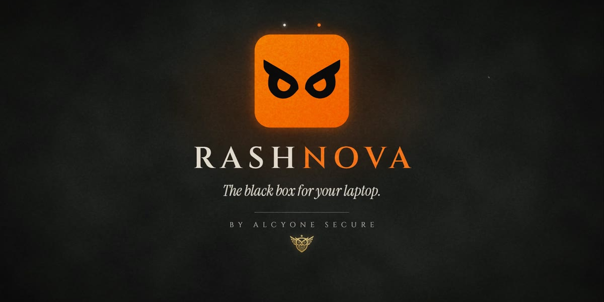
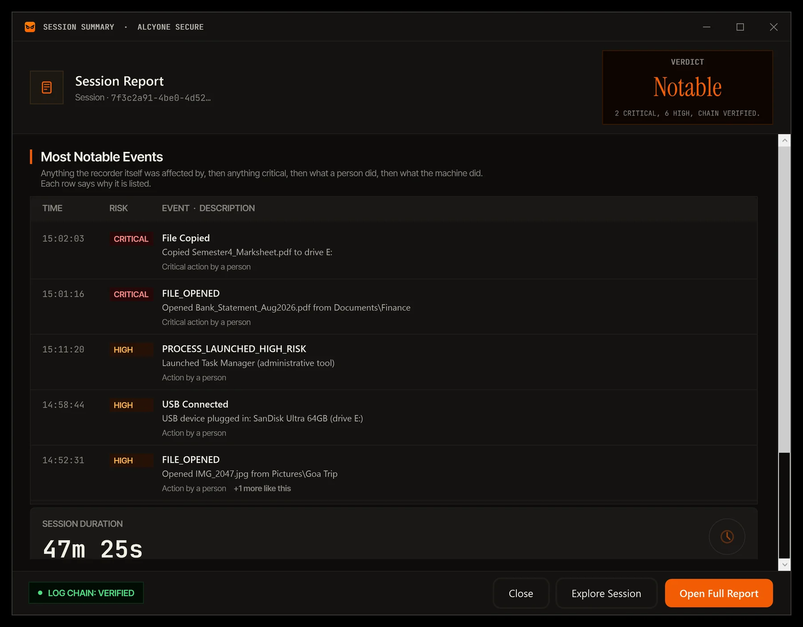
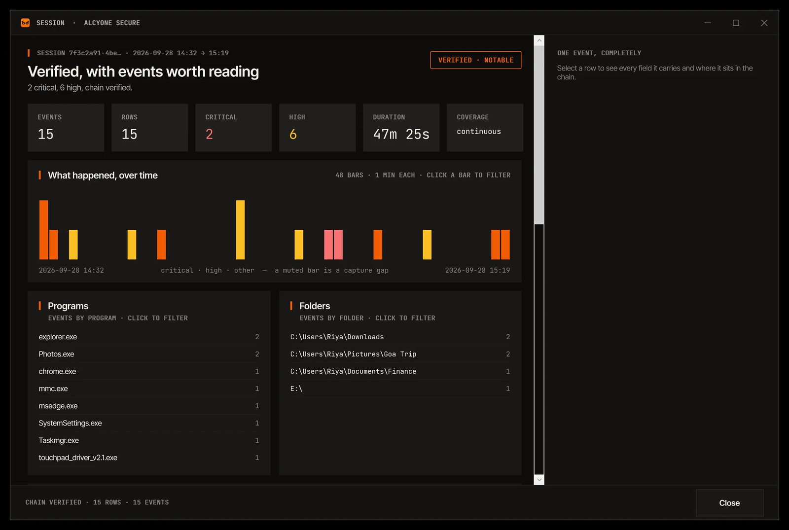
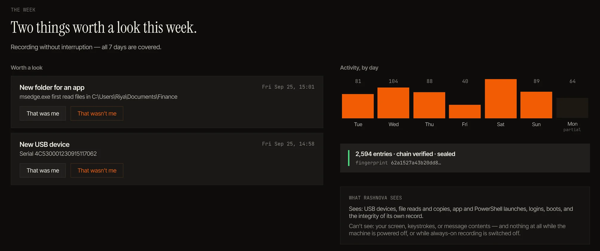
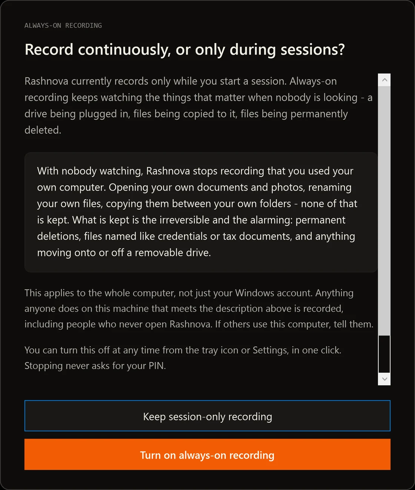
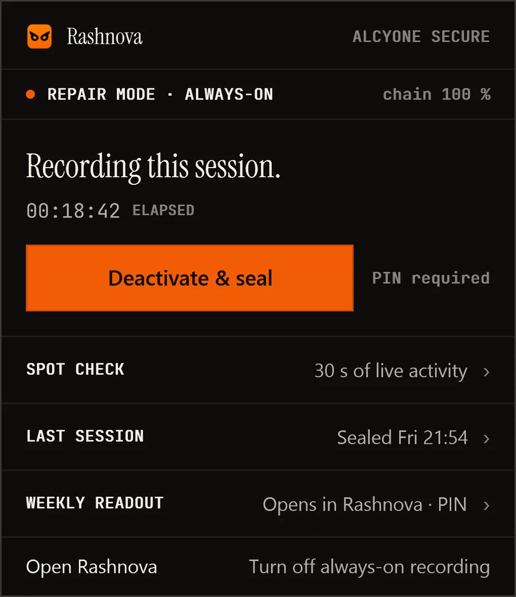

<div align="center">



# Rashnova

### Windows ಗಾಗಿ ತಿದ್ದುಪಡಿಯನ್ನು ತೋರಿಸುವ (tamper-evident) ಚಟುವಟಿಕೆ ರೆಕಾರ್ಡರ್

**ನಿಮ್ಮ PC ಅನ್ನು ಒಪ್ಪಿಸಿ. ಅದರಲ್ಲಿ ಏನು ಮಾಡಲಾಯಿತು ಎಂಬುದರ ಸೀಲ್ ಮಾಡಿದ ದಾಖಲೆಯೊಂದಿಗೆ ಅದನ್ನು ಮರಳಿ ಪಡೆಯಿರಿ.**

[](https://github.com/sathvik-zoldyck/rashnova/releases/latest)
[](https://github.com/sathvik-zoldyck/rashnova/releases)
[](#requirements)
[](#download)
[](LICENSE)

[**ಡೌನ್‌ಲೋಡ್**](https://github.com/sathvik-zoldyck/rashnova/releases/latest) ·
[**ವೆಬ್‌ಸೈಟ್**](https://www.alcyonesecure.com) ·
[**ತಿಳಿದಿರುವ ಮಿತಿಗಳು**](KNOWN_LIMITS.md) ·
[**ಗೌಪ್ಯತೆ**](#privacy) ·
[**ಭದ್ರತೆ**](SECURITY.md)

</div>

> **ಭಾಷೆಗಳು** &nbsp;·&nbsp; [English](README.md) · [हिन्दी](README.hi.md) · **ಕನ್ನಡ** · [മലയാളം](README.ml.md) · [Español](README.es.md) · [Français](README.fr.md) · [Deutsch](README.de.md) · [Português](README.pt.md) · [日本語](README.ja.md) · [Bahasa Indonesia](README.id.md) · [עברית](README.he.md)

---
> [!NOTE]
> ಈ ಪುಟವನ್ನು ಇಂಗ್ಲಿಷ್‌ನಿಂದ ಅನುವಾದಿಸಲಾಗಿದೆ. Rashnova ಆ್ಯಪ್ ಇಂಗ್ಲಿಷ್‌ನಲ್ಲಿದೆ, ಆದ್ದರಿಂದ ಬಟನ್‌ಗಳು ಮತ್ತು ಪರದೆಗಳ ಹೆಸರುಗಳನ್ನು
> ಇಲ್ಲಿ ಇಂಗ್ಲಿಷ್‌ನಲ್ಲೇ ನೀಡಲಾಗಿದೆ. ಈ ಪುಟ ಮತ್ತು [ಇಂಗ್ಲಿಷ್ ಆವೃತ್ತಿ](README.md) ಭಿನ್ನವಾಗಿದ್ದರೆ, ಇಂಗ್ಲಿಷ್ ಆವೃತ್ತಿಯೇ ಸರಿ.


ನಿಮ್ಮ Windows PC ಬೇರೆಯವರ ಕೈಯಲ್ಲಿದ್ದಾಗ ಅದರಲ್ಲಿ ಏನು ನಡೆಯುತ್ತದೆ ಎಂಬುದನ್ನು Rashnova ದಾಖಲಿಸುತ್ತದೆ: ರಿಪೇರಿ ಅಂಗಡಿಯಲ್ಲಿ,
IT ಡೆಸ್ಕ್‌ನಲ್ಲಿ, ಅಥವಾ ನೀವು ಅದನ್ನು ಒಪ್ಪಿಸುವ ಯಾರ ಬಳಿಯಾದರೂ. ಒಪ್ಪಿಸುವ ಮೊದಲು ಒಂದು **Repair session** ಆರಂಭಿಸಿ. PC
ಮರಳಿ ಬಂದಾಗ ಅದನ್ನು ಮುಗಿಸಿ. ಆಗ Rashnova ನಿಮಗೆ ಒಂದು ತೀರ್ಪು (verdict) ಮತ್ತು ವರದಿ ನೀಡುತ್ತದೆ: ಏನು ತೆರೆಯಲಾಯಿತು, ನಕಲು
ಮಾಡಲಾಯಿತು, ಹೆಸರು ಬದಲಿಸಲಾಯಿತು ಮತ್ತು ಅಳಿಸಲಾಯಿತು, ಯಾವ ಪ್ರೋಗ್ರಾಂಗಳು ಚಲಿಸಿದವು, ಮತ್ತು ಯಾವ USB ಡ್ರೈವ್‌ಗಳನ್ನು ಜೋಡಿಸಲಾಯಿತು.

ಪ್ರತಿ ನಮೂದನ್ನು ಅದರ ಹಿಂದಿನ ನಮೂದಿಗೆ ಸೀಲ್ ಮಾಡಲಾಗುತ್ತದೆ. ಹೀಗಾಗಿ ಅದರಲ್ಲಿ ಏನಾದರೂ ಬದಲಾಯಿಸಲಾಗಿದೆಯೇ ಅಥವಾ ತೆಗೆದುಹಾಕಲಾಗಿದೆಯೇ
ಎಂಬುದನ್ನು ದಾಖಲೆ ತೋರಿಸುತ್ತದೆ, ಮತ್ತು ಏನನ್ನೂ ದಾಖಲಿಸಲು ಸಾಧ್ಯವಾಗದ ಪ್ರತಿಯೊಂದು ಅವಧಿಯನ್ನೂ ತೋರಿಸುತ್ತದೆ. ಎಲ್ಲವೂ ನಿಮ್ಮ
ಕಂಪ್ಯೂಟರ್‌ನಲ್ಲೇ ಇರುತ್ತದೆ. ಖಾತೆ ಇಲ್ಲ, ಕ್ಲೌಡ್ ಇಲ್ಲ, ಟೆಲಿಮೆಟ್ರಿ ಇಲ್ಲ.


> [!NOTE]
> ಈ ರೆಪೊಸಿಟರಿಯಲ್ಲಿ Rashnova ಅನ್ನು **ಬಿಡುಗಡೆ (release)** ಮಾಡಲಾಗುತ್ತದೆ: ಇನ್‌ಸ್ಟಾಲರ್‌ಗಳು, ಬಿಡುಗಡೆ ಟಿಪ್ಪಣಿಗಳು,
> ತಿಳಿದಿರುವ ಮಿತಿಗಳು ಮತ್ತು ಭದ್ರತಾ ನೀತಿ. Rashnova, [Alcyone Secure](https://www.alcyonesecure.com) ಅವರ ಸ್ವಾಮ್ಯದ
> (proprietary) ಸಾಫ್ಟ್‌ವೇರ್; ಅದರ ಸೋರ್ಸ್ ಕೋಡ್ ಅನ್ನು ಇಲ್ಲಿ ಪ್ರಕಟಿಸಲಾಗುವುದಿಲ್ಲ.


## ವಿಷಯಗಳು

- [Rashnova ಏಕೆ](#why)
- [ಇದು ಏನು ಮಾಡುತ್ತದೆ](#what-it-does)
- [ಇದು ಎಂದಿಗೂ ಏನನ್ನು ದಾಖಲಿಸುವುದಿಲ್ಲ](#never)
- [ಇದು ಹೇಗೆ ಕೆಲಸ ಮಾಡುತ್ತದೆ](#how)
- [ಡೌನ್‌ಲೋಡ್ ಮತ್ತು ಇನ್‌ಸ್ಟಾಲ್](#download)
- [ಸಿಸ್ಟಮ್ ಅಗತ್ಯತೆಗಳು](#requirements)
- [ಗೌಪ್ಯತೆ](#privacy)
- [ತಿಳಿದಿರುವ ಮಿತಿಗಳು](#limits)
- [ಅಪ್‌ಡೇಟ್‌ಗಳು](#updates)
- [ಸಹಾಯ ಮತ್ತು ಭದ್ರತೆ](#support)
- [ಪರವಾನಗಿ](#licence)

<a name="why"></a>
## Rashnova ಏಕೆ

ವಿಮಾನ, ರೈಲು ಮತ್ತು ಹಡಗುಗಳಲ್ಲಿ ಬ್ಲ್ಯಾಕ್ ಬಾಕ್ಸ್ ಇರುತ್ತದೆ. ನಿಮ್ಮ ಕೈಯಿಂದ ಹೊರಹೋಗುವ ಕಂಪ್ಯೂಟರ್‌ನಲ್ಲಿ ಏನೂ ಇರುವುದಿಲ್ಲ,
ಮತ್ತು ಅದನ್ನು ಹಿಡಿದಿರುವ ವ್ಯಕ್ತಿಗೆ ಅದರಲ್ಲಿನ ಎಲ್ಲದಕ್ಕೂ ಪ್ರವೇಶವಿರುತ್ತದೆ.

ಆ ಪ್ರವೇಶವನ್ನು ಬಳಸಲಾಗುತ್ತದೆ. [University of Guelph ಸಂಶೋಧಕರ 2022ರ ಅಧ್ಯಯನದಲ್ಲಿ](https://arxiv.org/abs/2211.05824)
(IEEE Symposium on Security and Privacy 2023 ರಲ್ಲಿ ಪ್ರಕಟ), ಲಾಗಿಂಗ್ ಆನ್ ಮಾಡಿದ ಲ್ಯಾಪ್‌ಟಾಪ್‌ಗಳನ್ನು 12 ರಿಪೇರಿ ಅಂಗಡಿಗಳಲ್ಲಿ
ರಾತ್ರಿಯಿಡೀ ಬಿಡಲಾಯಿತು. ಅವುಗಳಲ್ಲಿ ಆರು ಕಡೆಯ ತಂತ್ರಜ್ಞರು ಅವುಗಳಲ್ಲಿದ್ದ ವೈಯಕ್ತಿಕ ಡೇಟಾವನ್ನು ತೆರೆದರು, ಮತ್ತು ಇಬ್ಬರು
ಲ್ಯಾಪ್‌ಟಾಪ್‌ನಿಂದ ಡೇಟಾವನ್ನು ನಕಲು ಮಾಡಿಕೊಂಡರು. ಆಂಟಿವೈರಸ್ ಮತ್ತು ಎಂಡ್‌ಪಾಯಿಂಟ್ ಉಪಕರಣಗಳನ್ನು ಇದನ್ನು ಗಮನಿಸಲು ನಿರ್ಮಿಸಿಯೇ
ಇಲ್ಲ: ಆ ವ್ಯಕ್ತಿಗೆ ಕೀಲಿಗಳನ್ನು ಸ್ವತಃ ಕೊಡಲಾಗಿತ್ತು.

Rashnova ತಡೆಗಟ್ಟುವಿಕೆ ಅಲ್ಲ. ಇದು ಸಾಕ್ಷ್ಯ, ಇದರಿಂದ ನಡೆದದ್ದನ್ನು ವಾದದಿಂದಲ್ಲ, ಪರಿಶೀಲನೆಯಿಂದ ತಿಳಿಯಬಹುದು.

> *ನಂಬಿಕೆ ಒಳ್ಳೆಯದು. ಪುರಾವೆ ಅದಕ್ಕಿಂತ ಉತ್ತಮ.*

<a name="what-it-does"></a>
## ಇದು ಏನು ಮಾಡುತ್ತದೆ

<table>
<tr>
<td width="50%" valign="top">

**Repair Mode (ರಿಪೇರಿ ಮೋಡ್).** ಒಂದು ಗಮನಿಸಲ್ಪಡುವ ಸೆಷನ್: ಒಪ್ಪಿಸುವ ಮೊದಲು ನಿಮ್ಮ PIN ನಿಂದ ಆರಂಭ, PC ಮರಳಿ
ಬಂದಾಗ ನಿಮ್ಮ PIN ನಿಂದ ಮುಕ್ತಾಯ. ಇದು ದಾಖಲಿಸುತ್ತದೆ: ತೆರೆದ, ರಚಿಸಿದ, ಹೆಸರು ಬದಲಿಸಿದ, ನಕಲು ಮಾಡಿದ ಮತ್ತು ಅಳಿಸಿದ ಫೈಲ್‌ಗಳು,
ಆರಂಭಿಸಿದ ಪ್ರೋಗ್ರಾಂಗಳು, ಚಲಾಯಿಸಿದ PowerShell ಕಮಾಂಡ್‌ಗಳು, ಸೈನ್-ಇನ್‌ಗಳು, ಮತ್ತು ಜೋಡಿಸಿದ USB ಸ್ಟೋರೇಜ್, ಅದಕ್ಕೆ ಬರೆದ
ಪ್ರತಿ ಫೈಲ್ ಸಹಿತ. ರೀಸ್ಟಾರ್ಟ್, ಶಟ್‌ಡೌನ್ ಅಥವಾ ಸ್ಲೀಪ್ ಸೆಷನ್ ಅನ್ನು ಎಂದಿಗೂ ಮುಗಿಸುವುದಿಲ್ಲ: ವರದಿ ಪ್ರತಿ ಅಡಚಣೆಯನ್ನು ಮತ್ತು
ಅದರ ಅವಧಿಯನ್ನು ತೋರಿಸುತ್ತದೆ.

</td>
<td width="50%" valign="top">



</td>
</tr>
<tr>
<td width="50%" valign="top">



</td>
<td width="50%" valign="top">

**ನೀವು ಪರಿಶೀಲಿಸಬಹುದಾದ ದಾಖಲೆ.** ಪ್ರತಿ ಸೆಷನ್ ಒಂದು ತೀರ್ಪು ಮತ್ತು ವರದಿಯೊಂದಿಗೆ ಮುಗಿಯುತ್ತದೆ; ಅದನ್ನು PDF, ವೆಬ್
ಪುಟ ಅಥವಾ ಸ್ಪ್ರೆಡ್‌ಶೀಟ್ ಆಗಿ ಉಳಿಸಬಹುದು. ಸೆಷನ್ ಎಕ್ಸ್‌ಪ್ಲೋರರ್ ಪ್ರತಿ ಘಟನೆಯನ್ನು ಕಾಲಾನುಕ್ರಮದಲ್ಲಿ, ಪ್ರೋಗ್ರಾಂ ಮತ್ತು ಫೋಲ್ಡರ್
ಪ್ರಕಾರ ತೋರಿಸುತ್ತದೆ, ಮತ್ತು ಚೈನ್ ಪರಿಶೀಲನೆ ದಾಖಲೆ ಅಖಂಡವಾಗಿದೆಯೇ ಎಂದು ಹೇಳುತ್ತದೆ. ನೀವು ಉಳಿಸುವುದು ಒಂದು ಪ್ರತಿ; ಮೂಲ
ದಾಖಲೆ Rashnova ಇಟ್ಟಿರುವಲ್ಲೇ ಉಳಿಯುತ್ತದೆ.

</td>
</tr>
<tr>
<td width="50%" valign="top">

**ವಾರದ Readout.** ನಿಮ್ಮ ವಾರ ಒಂದೇ ತೀರ್ಪಿನಲ್ಲಿ, ಮತ್ತು ಗಮನಿಸಬೇಕಾದ ಕೆಲವೇ ವಿಷಯಗಳು. ಪ್ರತಿಯೊಂದನ್ನೂ
"that was me" (ಅದು ನಾನೇ) ಅಥವಾ "that wasn't me" (ಅದು ನಾನಲ್ಲ) ಎಂದು ಗುರುತಿಸಿ. Rashnova ಏನನ್ನು ನೋಡಬಲ್ಲದು ಮತ್ತು
ಏನನ್ನು ನೋಡಲಾರದು ಎಂಬುದನ್ನೂ ಸರಳ ಪದಗಳಲ್ಲಿ ಹೇಳುತ್ತದೆ.

</td>
<td width="50%" valign="top">



</td>
</tr>
<tr>
<td width="50%" valign="top">



</td>
<td width="50%" valign="top">

**ಯಾವಾಗಲೂ-ಆನ್ (always-on) ರೆಕಾರ್ಡಿಂಗ್, ನೀವು ಆರಿಸಿದರೆ ಮಾತ್ರ.** ನೀವು ಆನ್ ಮಾಡುವವರೆಗೆ ಆಫ್ ಆಗಿರುತ್ತದೆ. ಇದು
ಹಿಂತಿರುಗಿಸಲಾಗದ ಮತ್ತು ಆತಂಕಕಾರಿ ವಿಷಯಗಳನ್ನು ಇಡುತ್ತದೆ (ಶಾಶ್ವತ ಅಳಿಸುವಿಕೆಗಳು, ಸೂಕ್ಷ್ಮವಾಗಿ ಕಾಣುವ ಫೈಲ್‌ಗಳು, ತೆಗೆಯಬಹುದಾದ
ಡ್ರೈವ್‌ಗೆ ಅಥವಾ ಅದರಿಂದ ಹೋಗುವ ಯಾವುದೇ ವಿಷಯ), ನಿಮ್ಮ ಸ್ವಂತ ಫೈಲ್‌ಗಳ ದಿನನಿತ್ಯದ ಬಳಕೆಯನ್ನಲ್ಲ. ಇದನ್ನು ಆಫ್ ಮಾಡುವುದು ಟ್ರೇ ಅಥವಾ
Settings ನಿಂದ ಒಂದು ಕ್ಲಿಕ್, ಮತ್ತು ಅದಕ್ಕೆ ಎಂದಿಗೂ PIN ಬೇಕಿಲ್ಲ.

</td>
</tr>
<tr>
<td width="50%" valign="top">

**ಟ್ರೇಯಿಂದ.** ಸೆಷನ್ ರೆಕಾರ್ಡ್ ಆಗುತ್ತಿದೆಯೇ ಎಂದು ನೋಡಿ, ಅದನ್ನು ಮುಗಿಸಿ, ಲೈವ್ ಫೈಲ್ ಚಟುವಟಿಕೆಯ 30 ಸೆಕೆಂಡ್‌ಗಳ ಪರಿಶೀಲನೆ
(Monitor Now) ನಡೆಸಿ, ಅಥವಾ ಕೊನೆಯ ವರದಿಯನ್ನು ತೆರೆಯಿರಿ.

</td>
<td width="50%" valign="top" align="center">



</td>
</tr>
</table>

<sub>ಸ್ಕ್ರೀನ್‌ಶಾಟ್‌ಗಳು Rashnova ಅನ್ನು ಒಂದು ಮಾದರಿ ಸೆಷನ್‌ನೊಂದಿಗೆ ತೋರಿಸುತ್ತವೆ (ಕಾಲ್ಪನಿಕ ಬಳಕೆದಾರ, "Riya").</sub>

<a name="never"></a>
## ಇದು ಎಂದಿಗೂ ಏನನ್ನು ದಾಖಲಿಸುವುದಿಲ್ಲ

Rashnova ಏನಾದರೂ ನಡೆಯಿತು **ಎಂಬುದನ್ನು** ದಾಖಲಿಸುತ್ತದೆ, ಪರದೆಯ ಮೇಲೆ ಏನಿತ್ತು ಎಂಬುದನ್ನಲ್ಲ. ಇದು ದಾಖಲಿಸುವುದಿಲ್ಲ:

- ಕೀಸ್ಟ್ರೋಕ್‌ಗಳು
- ಕ್ಲಿಪ್‌ಬೋರ್ಡ್‌ನ ವಿಷಯ
- ನಿಮ್ಮ ಪರದೆ, ಚಿತ್ರ ಅಥವಾ ವೀಡಿಯೊ ರೂಪದಲ್ಲಿ
- ನಿಮ್ಮ ಕ್ಯಾಮೆರಾ ಅಥವಾ ಮೈಕ್ರೊಫೋನ್
- ನಿಮ್ಮ ದಾಖಲೆಗಳು, ಫೋಟೋಗಳು, ಇಮೇಲ್‌ಗಳು ಅಥವಾ ಸಂದೇಶಗಳ ವಿಷಯ
- ನೀವು ನೋಡುವ ವೆಬ್ ಪುಟಗಳು, ಅಥವಾ ಅವುಗಳಲ್ಲಿ ಏನಿದೆ

ಇದು ದಾಖಲಿಸುವ ಎರಡು ವಿಷಯಗಳನ್ನು ತಿಳಿದಿರುವುದು ಒಳ್ಳೆಯದು. Repair session ಸಮಯದಲ್ಲಿ PowerShell ಕಮಾಂಡ್‌ಗಳು ಚಲಿಸುವಾಗ
ದಾಖಲಾಗುತ್ತವೆ, ಮತ್ತು ವ್ಯಕ್ತಿಯೊಬ್ಬರು ಆರಂಭಿಸುವ ಪ್ರತಿ ಪ್ರೋಗ್ರಾಂನ ಸಂಪೂರ್ಣ ಸ್ಟಾರ್ಟ್-ಅಪ್ ಲೈನ್ ಕೂಡ; ಹೀಗಾಗಿ ಲಿಂಕ್‌ನಿಂದ ತೆರೆದ
ಬ್ರೌಸರ್ ಆ ಲಿಂಕ್ ಅನ್ನು ತೋರಿಸುತ್ತದೆ.

ಉದಾಹರಣೆಗೆ, `Bank_Statement_Aug2026.pdf` ಅನ್ನು `Documents\Finance` ನಿಂದ Microsoft Edge 15:01:16 ಕ್ಕೆ
ತೆರೆಯಿತು ಎಂದು ವರದಿ ಹೇಳುತ್ತದೆ. ಸ್ಟೇಟ್‌ಮೆಂಟ್‌ನಲ್ಲಿ ಏನಿತ್ತು ಎಂದು ಹೇಳುವುದಿಲ್ಲ.

<a name="how"></a>
## ಇದು ಹೇಗೆ ಕೆಲಸ ಮಾಡುತ್ತದೆ

1. **ಇನ್‌ಸ್ಟಾಲ್ ಮಾಡಿ.** Setup, Rashnova ಮತ್ತು ಅದರ ಹಿನ್ನೆಲೆ ರೆಕಾರ್ಡರ್ ಅನ್ನು ಇನ್‌ಸ್ಟಾಲ್ ಮಾಡುತ್ತದೆ.
2. **PIN ಹೊಂದಿಸಿ.** PIN ಅನ್ನು ಆ್ಯಪ್ ವಿಂಡೋ ಅಲ್ಲ, ರೆಕಾರ್ಡರ್ ಪರಿಶೀಲಿಸುತ್ತದೆ.
3. **ಒಪ್ಪಿಸುವ ಮೊದಲು:** **Repair Mode > Activate**, ನಂತರ ನಿಮ್ಮ PIN.
4. **ಒಪ್ಪಿಸಿ.** "ಇದು ಏನು ಮಾಡುತ್ತದೆ" ವಿಭಾಗದಲ್ಲಿರುವ ಎಲ್ಲವೂ ಸೀಲ್ ಮಾಡಿದ ದಾಖಲೆಗೆ ಬರೆಯಲ್ಪಡುತ್ತದೆ.
5. **ಮರಳಿ ಪಡೆದಾಗ:** **Deactivate**, ನಂತರ ನಿಮ್ಮ PIN. ನಿಮಗೆ ತೀರ್ಪು, ವರದಿ ಮತ್ತು ಚೈನ್ ಪರಿಶೀಲನೆ ಸಿಗುತ್ತದೆ.

ರೆಕಾರ್ಡರ್ Windows ಸರ್ವೀಸ್ ಆಗಿ ಚಲಿಸುತ್ತದೆ, ಆದ್ದರಿಂದ ಯಾರಾದರೂ Rashnova ವಿಂಡೋ ತೆರೆಯಲಿ ಬಿಡಲಿ ರೆಕಾರ್ಡಿಂಗ್
ಮುಂದುವರಿಯುತ್ತದೆ, ಮತ್ತು ರೀಸ್ಟಾರ್ಟ್ ನಂತರ ಅದು ತಾನಾಗಿಯೇ ಮತ್ತೆ ಆರಂಭವಾಗುತ್ತದೆ.

**ಪ್ರತಿ ಸೆಷನ್ ನಾಲ್ಕು ತೀರ್ಪುಗಳಲ್ಲಿ ಒಂದರೊಂದಿಗೆ ಮುಗಿಯುತ್ತದೆ:**

| ತೀರ್ಪು | ಅರ್ಥ |
| --- | --- |
| **Quiet** | ದಾಖಲೆ ಪರಿಶೀಲಿತವಾಗಿದೆ, ಸಂಪೂರ್ಣವಾಗಿದೆ, ಮತ್ತು ಹೆಚ್ಚಿನ ಮಹತ್ವದ ಏನೂ ನಡೆದಿಲ್ಲ. |
| **Notable** | ಕನಿಷ್ಠ ಒಂದು ಉನ್ನತ (high) ಅಥವಾ ಗಂಭೀರ (critical) ಘಟನೆ: ಓದಲು ಯೋಗ್ಯ. |
| **Compromised** | ಸೆಷನ್ ಒಳಗೆ ದಾಖಲೆಯಲ್ಲಿ ಅಂತರವಿದೆ (ಕಂಪ್ಯೂಟರ್ ಆಫ್ ಆಗಿತ್ತು, ಸ್ಲೀಪ್‌ನಲ್ಲಿತ್ತು ಅಥವಾ ರೀಸ್ಟಾರ್ಟ್ ಆಗುತ್ತಿತ್ತು, ಅಥವಾ ಮೇಲ್ವಿಚಾರಣೆ ಅಡ್ಡಿಯಾಯಿತು) ಅಥವಾ ಹಸ್ತಕ್ಷೇಪ ಕಾಣುತ್ತದೆ, ಆದ್ದರಿಂದ ಇದು ಇಡೀ ಸೆಷನ್‌ಗೆ ಖಾತರಿ ನೀಡಲಾರದು. |
| **Chain broken** | ದಾಖಲೆ ಪರಿಶೀಲನೆಯಲ್ಲಿ ತೇರ್ಗಡೆಯಾಗುವುದಿಲ್ಲ. ಎಲ್ಲವನ್ನೂ ಇನ್ನೂ ತೋರಿಸಲಾಗುತ್ತದೆ, ಪರಿಶೀಲಿಸದ್ದು ಎಂದು ಗುರುತಿಸಿ. |

<a name="download"></a>
## ಡೌನ್‌ಲೋಡ್ ಮತ್ತು ಇನ್‌ಸ್ಟಾಲ್

| ಫೈಲ್ | ಯಾರಿಗಾಗಿ |
| --- | --- |
| **`Rashnova-Setup-1.1.0.exe`** | ಎಲ್ಲರಿಗೂ. ನಿಮ್ಮ PC ಯಲ್ಲಿ Microsoft ನ .NET 8 Desktop Runtime ಇಲ್ಲದಿದ್ದರೆ ಮೊದಲು ಅದನ್ನು, ನಂತರ Rashnova ಅನ್ನು ಇನ್‌ಸ್ಟಾಲ್ ಮಾಡುತ್ತದೆ. |
| `Rashnova-1.1.0.msi` | ತಮ್ಮದೇ ಉಪಕರಣಗಳಿಂದ ಇನ್‌ಸ್ಟಾಲ್ ಮಾಡುವ ಅಡ್ಮಿನಿಸ್ಟ್ರೇಟರ್‌ಗಳು. .NET 8 Desktop Runtime ಮೊದಲೇ ಇನ್‌ಸ್ಟಾಲ್ ಆಗಿರಬೇಕು. |
| `SHA256SUMS.txt` | ಪ್ರತಿ ಫೈಲ್‌ನ SHA-256, ನಿಮ್ಮ ಡೌನ್‌ಲೋಡ್ ಪರಿಶೀಲಿಸಲು. |

1. [ಇತ್ತೀಚಿನ ಬಿಡುಗಡೆಯಿಂದ](https://github.com/sathvik-zoldyck/rashnova/releases/latest) `Rashnova-Setup-1.1.0.exe` ಡೌನ್‌ಲೋಡ್ ಮಾಡಿ.
2. **ಫೈಲ್ ಪರಿಶೀಲಿಸಿ** (ಶಿಫಾರಸು). PowerShell ನಲ್ಲಿ:
   ```powershell
   Get-FileHash "$env:USERPROFILE\Downloads\Rashnova-Setup-1.1.0.exe"
   ```
   ಹ್ಯಾಶ್, `SHA256SUMS.txt` ಮತ್ತು ಬಿಡುಗಡೆ ಟಿಪ್ಪಣಿಗಳಲ್ಲಿರುವ ಹ್ಯಾಶ್‌ಗೆ ನಿಖರವಾಗಿ ಹೊಂದಿಕೆಯಾಗಬೇಕು.
3. ಅದನ್ನು ಚಲಾಯಿಸಿ. Windows SmartScreen ಅಪರಿಚಿತ ಪ್ರಕಾಶಕರೊಂದಿಗೆ **"Windows protected your PC"** ಎಂದು ತೋರಿಸುತ್ತದೆ,
   ಏಕೆಂದರೆ ಇನ್‌ಸ್ಟಾಲರ್‌ಗೆ ಇನ್ನೂ ಕೋಡ್-ಸೈನಿಂಗ್ ಆಗಿಲ್ಲ ([ತಿಳಿದಿರುವ ಮಿತಿಗಳು](KNOWN_LIMITS.md) ನೋಡಿ). **More info**
   ಆರಿಸಿ, ನಂತರ **Run anyway**.
4. [ಪರವಾನಗಿ ನಿಯಮಗಳನ್ನು](https://www.alcyonesecure.com/terms) ಒಪ್ಪಿ, ಇನ್‌ಸ್ಟಾಲ್ ಮಾಡಿ, ಮತ್ತು Rashnova ತೆರೆಯಿರಿ.
5. PIN ಹೊಂದಿಸಿ, ಮತ್ತು ಕೇವಲ-ಸೆಷನ್ ರೆಕಾರ್ಡಿಂಗ್ (ಡೀಫಾಲ್ಟ್) ಇಡಬೇಕೇ ಅಥವಾ ಯಾವಾಗಲೂ-ಆನ್ ರೆಕಾರ್ಡಿಂಗ್ ಆನ್ ಮಾಡಬೇಕೇ ಎಂದು ಆರಿಸಿ.


> [!IMPORTANT]
> ಮರೆತ PIN ಅನ್ನು ಮರುಪಡೆಯಲು ಸಾಧ್ಯವಿಲ್ಲ, ನಮ್ಮಿಂದಲೂ ಇಲ್ಲ, ಬೇರೆ ಯಾರಿಂದಲೂ ಇಲ್ಲ. ಅದನ್ನು ಸುರಕ್ಷಿತ ಸ್ಥಳದಲ್ಲಿ ಬರೆದಿಡಿ.
> ಯಾವಾಗಲೂ-ಆನ್ ರೆಕಾರ್ಡಿಂಗ್ ಆಫ್ ಮಾಡಲು ಎಂದಿಗೂ PIN ಬೇಕಿಲ್ಲ.


**BlackBox 1.0.1 ನಿಂದ ಬರುತ್ತಿದ್ದೀರಾ?** Rashnova, BlackBox ನ ಹೊಸ ಹೆಸರು. 1.1.0 ಡೌನ್‌ಲೋಡ್ ಮಾಡಿ ಇನ್‌ಸ್ಟಾಲ್ ಮಾಡಿ.

<a name="requirements"></a>
## ಸಿಸ್ಟಮ್ ಅಗತ್ಯತೆಗಳು

- Windows 10 ಅಥವಾ Windows 11, 64-ಬಿಟ್ (Windows 10 ನಲ್ಲಿ ಪರೀಕ್ಷಿಸಲಾಗಿದೆ)
- Microsoft .NET 8 Desktop Runtime (ಇಲ್ಲದಿದ್ದರೆ Setup ಅದನ್ನು ಇನ್‌ಸ್ಟಾಲ್ ಮಾಡುತ್ತದೆ)
- ಇನ್‌ಸ್ಟಾಲ್ ಮಾಡಲು ಅಡ್ಮಿನಿಸ್ಟ್ರೇಟರ್ ಅನುಮತಿ, ಏಕೆಂದರೆ ರೆಕಾರ್ಡರ್ Windows ಸರ್ವೀಸ್ ಆಗಿ ಚಲಿಸುತ್ತದೆ

<a name="privacy"></a>
## ಗೌಪ್ಯತೆ

- **ಸ್ಥಳೀಯ ಮಾತ್ರ.** ದಾಖಲೆಯನ್ನು ನಿಮ್ಮ ಕಂಪ್ಯೂಟರ್‌ನಲ್ಲೇ ಬರೆಯಲಾಗುತ್ತದೆ ಮತ್ತು ಇಡಲಾಗುತ್ತದೆ. 1.1.0 ನಲ್ಲಿ ಖಾತೆ ಇಲ್ಲ,
  ಕ್ಲೌಡ್ ಇಲ್ಲ, ಮತ್ತು Rashnova ಯಾವುದೇ ಬಳಕೆ-ಡೇಟಾ ಕಳುಹಿಸುವುದಿಲ್ಲ.
- **ಎರಡು ಸಣ್ಣ ವಿನಂತಿಗಳು,** ಯಾವುದರಲ್ಲೂ ನಿಮ್ಮ ದಾಖಲೆಯ ಏನೂ ಇರುವುದಿಲ್ಲ: ಹೊಸ ಆವೃತ್ತಿಗಾಗಿ alcyonesecure.com ನ ದೈನಂದಿನ
  ಪರಿಶೀಲನೆ, ಮತ್ತು Repair session ಸಮಯದಲ್ಲಿ Microsoft ನ ಟೈಮ್ ಸರ್ವರ್‌ನೊಂದಿಗೆ ಸಮಯದ ಪರಿಶೀಲನೆ.
- **ದಾಖಲೆಯನ್ನು ಯಾರು ಓದಬಹುದು.** PIN ಹೊಂದಿಸಿದ Windows ಖಾತೆ, ಮತ್ತು ಕಂಪ್ಯೂಟರ್‌ನ ಅಡ್ಮಿನಿಸ್ಟ್ರೇಟರ್‌ಗಳು. ಎರಡನೇ ಪ್ರತಿ
  ಎನ್‌ಕ್ರಿಪ್ಟ್ ಆಗಿದೆ, ಮತ್ತು Rashnova ಅದನ್ನು ನಿಮ್ಮ PIN ಪರಿಶೀಲಿಸಿದ ನಂತರವೇ ತೆರೆಯುತ್ತದೆ. ಕಂಪ್ಯೂಟರ್‌ನ ಅಡ್ಮಿನಿಸ್ಟ್ರೇಟರ್‌ಗಳು
  ಇನ್ನೂ ಅದನ್ನು ಓದಬಲ್ಲರು.
- **ನಿಮ್ಮ PC ಬಳಸುವವರಿಗೆ ತಿಳಿಸಿ.** ಯಾವಾಗಲೂ-ಆನ್ ರೆಕಾರ್ಡಿಂಗ್ ಇಡೀ ಕಂಪ್ಯೂಟರ್‌ಗೆ ಅನ್ವಯಿಸುತ್ತದೆ, Rashnova ಎಂದಿಗೂ
  ತೆರೆಯದವರಿಗೂ ಸಹ.
- **ಒಂದು Windows ಸೆಟ್ಟಿಂಗ್, ಸ್ಪಷ್ಟವಾಗಿ.** ರೆಕಾರ್ಡಿಂಗ್ ಮೊದಲ ಬಾರಿ ಆನ್ ಮಾಡಿದಾಗ, Rashnova Windows ನ PowerShell
  ಸ್ಕ್ರಿಪ್ಟ್ ಲಾಗಿಂಗ್ ಅನ್ನು ಆನ್ ಮಾಡುತ್ತದೆ, ಮತ್ತು ಸೆಟ್ಟಿಂಗ್ ಮೊದಲು ಏನಾಗಿತ್ತು ಎಂದು ದಾಖಲಿಸುತ್ತದೆ. ಬೇರೆಯವರು ಆನ್ ಮಾಡಿದ
  ಸೆಟ್ಟಿಂಗ್ ಅನ್ನು ಇದು ಎಂದಿಗೂ ಆಫ್ ಮಾಡುವುದಿಲ್ಲ.

<a name="limits"></a>
## ತಿಳಿದಿರುವ ಮಿತಿಗಳು

Rashnova ಏನು ಮಾಡುವುದಿಲ್ಲ ಎಂಬುದನ್ನು ನಾವು ಪ್ರಕಟಿಸುತ್ತೇವೆ, ಇದರಿಂದ ನೀವು ಸತ್ಯಗಳ ಆಧಾರದ ಮೇಲೆ ನಿರ್ಧರಿಸಬಹುದು. ಅತ್ಯಂತ ಮುಖ್ಯವಾದವು:

- **ಕಂಪ್ಯೂಟರ್ ಆಫ್, ಸ್ಲೀಪ್ ಅಥವಾ ರೀಸ್ಟಾರ್ಟ್ ಆಗುತ್ತಿರುವಾಗ ಏನನ್ನೂ ದಾಖಲಿಸಲು ಸಾಧ್ಯವಿಲ್ಲ.** ಸೆಷನ್ ಮುಂದುವರಿಯುತ್ತದೆ,
  ಮತ್ತು ವರದಿ ಪ್ರತಿ ಅಡಚಣೆಯನ್ನು ಮತ್ತು ಅದರ ಅವಧಿಯನ್ನು ತೋರಿಸುತ್ತದೆ.
- **ಅಡ್ಮಿನಿಸ್ಟ್ರೇಟರ್‌ಗಳು ದಾಖಲೆಯನ್ನು ಓದಬಲ್ಲರು.** ಯಾವುದೇ ಪ್ರೋಗ್ರಾಂ ತನ್ನ ಫೈಲ್‌ಗಳನ್ನು Windows ಅಡ್ಮಿನಿಸ್ಟ್ರೇಟರ್‌ನಿಂದ ಮರೆಮಾಡಲಾರದು.
- **ಇನ್‌ಸ್ಟಾಲರ್‌ಗೆ ಇನ್ನೂ ಕೋಡ್-ಸೈನಿಂಗ್ ಆಗಿಲ್ಲ,** ಆದ್ದರಿಂದ ಚಲಾಯಿಸುವ ಮೊದಲು Windows SmartScreen ಎಚ್ಚರಿಸುತ್ತದೆ.
- **USB ಸ್ಟೋರೇಜ್ ತಡೆಯುವಿಕೆ 1.1.0 ನಲ್ಲಿ ಇಲ್ಲ.** ಪ್ರತಿ USB ಡ್ರೈವ್ ಮತ್ತು ಅದಕ್ಕೆ ನಕಲು ಮಾಡಿದ ಪ್ರತಿ ಫೈಲ್ ದಾಖಲಾಗುತ್ತದೆ;
  ತಡೆಯುವಿಕೆ ಒಂದು ಅಪ್‌ಡೇಟ್‌ನಲ್ಲಿ ಬರುತ್ತದೆ.

ಪ್ರತಿಯೊಂದರ ಕಾರಣ ಮತ್ತು ಯೋಜನೆಯೊಂದಿಗೆ ಸಂಪೂರ್ಣ ಪಟ್ಟಿ (ಇಂಗ್ಲಿಷ್‌ನಲ್ಲಿ): **[KNOWN_LIMITS.md](KNOWN_LIMITS.md)**.

<a name="updates"></a>
## ಅಪ್‌ಡೇಟ್‌ಗಳು

Rashnova ದಿನಕ್ಕೆ ಒಮ್ಮೆ ಹೊಸ ಆವೃತ್ತಿಗಾಗಿ alcyonesecure.com ಅನ್ನು ಪರಿಶೀಲಿಸಿ, ಇದ್ದರೆ ನಿಮಗೆ ತಿಳಿಸುತ್ತದೆ. ನೀವೇ ಅದನ್ನು
ಡೌನ್‌ಲೋಡ್ ಮಾಡಿ ಇನ್‌ಸ್ಟಾಲ್ ಮಾಡುತ್ತೀರಿ; ನಿಮ್ಮ ದಾಖಲೆ, PIN ಮತ್ತು ಸೆಟ್ಟಿಂಗ್‌ಗಳು ಉಳಿಯುತ್ತವೆ. ಪ್ರತಿ ಆವೃತ್ತಿಯನ್ನು ಅದರ ಬಿಡುಗಡೆ
ಟಿಪ್ಪಣಿಗಳು ಮತ್ತು SHA-256 ನೊಂದಿಗೆ ಇಲ್ಲಿ ಪ್ರಕಟಿಸಲಾಗುತ್ತದೆ. [ಚೇಂಜ್‌ಲಾಗ್](CHANGELOG.md) ನೋಡಿ.

<a name="support"></a>
## ಸಹಾಯ ಮತ್ತು ಭದ್ರತೆ

- **ಸಹಾಯ:** [SUPPORT.md](SUPPORT.md) ನೋಡಿ, ಅಥವಾ **support@alcyonesecure.com** ಗೆ ಬರೆಯಿರಿ.
- **ಬಗ್‌ಗಳು:** [ಒಂದು issue ತೆರೆಯಿರಿ](https://github.com/sathvik-zoldyck/rashnova/issues/new/choose). issue ನಲ್ಲಿ ನಿಮ್ಮ
  ದಾಖಲೆ, ಫೈಲ್ ಹೆಸರುಗಳು ಅಥವಾ ವೈಯಕ್ತಿಕವಾದ ಏನನ್ನೂ ಎಂದಿಗೂ ಹಾಕಬೇಡಿ.
- **ಭದ್ರತಾ ದೌರ್ಬಲ್ಯಗಳು:** ಸಾರ್ವಜನಿಕ issue ತೆರೆಯಬೇಡಿ. [SECURITY.md](SECURITY.md) ಅನುಸರಿಸಿ.

<a name="licence"></a>
## ಪರವಾನಗಿ

Rashnova ಸ್ವಾಮ್ಯದ ಸಾಫ್ಟ್‌ವೇರ್; ನಿಮ್ಮದೇ ಆದ ಅಥವಾ ಮೇಲ್ವಿಚಾರಣೆಗೆ ನೀವು ಅಧಿಕೃತರಾಗಿರುವ ಸಾಧನಗಳಲ್ಲಿ ಬಳಕೆಗೆ ಉಚಿತ.
[LICENSE](LICENSE) ಮತ್ತು [ನಿಯಮಗಳು](https://www.alcyonesecure.com/terms) ನೋಡಿ (ಇಂಗ್ಲಿಷ್‌ನಲ್ಲಿ; ಅವೇ ಮಾನ್ಯ). ಈ ರೆಪೊಸಿಟರಿಯ
ದಾಖಲೆಗಳು ಮತ್ತು ಚಿತ್ರಗಳು © Alcyone Secure.

---

<div align="center">


**Alcyone Secure** · ಬೆಂಗಳೂರು, ಭಾರತದಲ್ಲಿ ನಿರ್ಮಿತ · [alcyonesecure.com](https://www.alcyonesecure.com)

*ಭದ್ರತೆ ಕೇವಲ ತಡೆಗಟ್ಟುವಿಕೆ ಅಲ್ಲ. ಭದ್ರತೆ ಎಂದರೆ ಹೊಣೆಗಾರಿಕೆ.*

</div>
